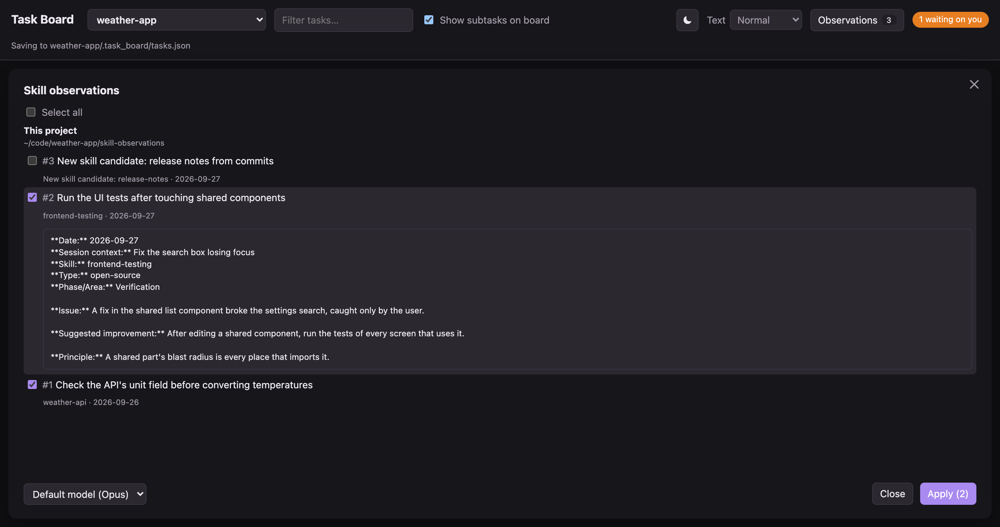

# onemoretask

A local kanban board that hands cards to Claude Code. Write a task, click **Send to Claude**,
and the agent works on it in the background, posting its progress, questions and results
back onto the card.


| Claude asks you a question | Claude reports it is done |
|---|---|
|  |  |

## Requirements

- macOS, Linux or Windows
- Python 3.7 or newer, and `git`
- [Claude Code](https://claude.com/claude-code) (the `claude` command), for Send to Claude

Desktop notifications are macOS only. The **Open folder…** dialog works on macOS and Windows;
on Linux, paste the folder's path. Everything else works the same on all three.

## Install

Run this in a terminal:

```bash
curl -fsSL https://raw.githubusercontent.com/astanar01/onemoretask/main/install.sh | sh
```

It:

- downloads the app to `~/.onemoretask`
- adds the `onemoretask` command to `~/.local/bin`
- adds `~/.local/bin` to your PATH if it isn't there yet (then open a new terminal)
- copies the task-observer skill that ships with the app into `~/.claude/skills/task-observer`
  (see [Skill observations](#skill-observations)). Your own copy is never changed.
  Set `ONEMORETASK_NO_OBSERVER=1` to skip this.
- makes a double-click shortcut that starts the board (see [Shortcut](#shortcut)).
  Set `ONEMORETASK_NO_SHORTCUT=1` to skip this.

Already cloned the repo? Run `./install.sh` inside it instead. It uses that copy.

### Windows

No WSL needed. First install:

- Python from [python.org](https://www.python.org/downloads/), or `winget install Python.Python.3.12`
- [Git for Windows](https://git-scm.com/download/win), or `winget install Git.Git`.
  Claude Code on Windows needs its Git Bash anyway.
- Claude Code with its native Windows installer (`claude.exe`), so `claude` works from PowerShell

Then run this in PowerShell:

```powershell
irm https://raw.githubusercontent.com/astanar01/onemoretask/main/install.ps1 | iex
```

It downloads the app to `%USERPROFILE%\.onemoretask`, puts `onemoretask.cmd` in
`%USERPROFILE%\.local\bin`, adds that folder to your user PATH, installs the task-observer skill
the same way, and makes a **OneMoreTask** shortcut on the Desktop and in the Start menu. Open a new
terminal after.

Already cloned the repo? Run `powershell -ExecutionPolicy Bypass -File install.ps1` inside it.

## Run

```bash
onemoretask
```

This starts the board and opens http://127.0.0.1:8765 in your browser. If the board is
already running, it just opens the page. Press **Ctrl-C** in the terminal to stop it.
It works the same in PowerShell, cmd or a macOS/Linux terminal. Without the command,
run `python3 launch.py` (Windows: `py launch.py`) in the app folder.

### Shortcut

No terminal needed after the install: double-click the shortcut it made. It opens a terminal window
that runs the board and opens the page. Close that window to stop the board.

| System | Shortcut |
|---|---|
| macOS | `OneMoreTask.command` on the Desktop, and `OneMoreTask` in `~/Applications` (Spotlight, Launchpad) |
| Linux | `OneMoreTask` in the app menu, and `onemoretask.desktop` on the Desktop |
| Windows | `OneMoreTask` on the Desktop and in the Start menu. The window stays open if it fails (for example, no Python) |

Deleted it? Run the install command again.

### Options

| Option | What it does |
|---|---|
| `--port 9000` | Use another port (default 8765) |
| `--project PATH` | Open this folder's board |
| `--permission-mode MODE` | Permission mode for agents started with Send to Claude (default `auto`) |

Without `--project`, the board opens the projects you used before. The first time, it opens
the git repo you run it from.

## Use

1. **Pick a project.** The project menu at the top switches boards. **Open folder…** adds any
   folder. Each project keeps its board in `<project>/.task_board/`. The board
   stays out of git: tasks are not committed. A project with work
   waiting on you shows `*` and a count in the menu, e.g. `weather-app * (2)`: questions, plus
   finished cards you have not opened yet.
2. **Add a task.** Give it a title, notes, subtasks. You can paste images into the notes.
3. **Send to Claude.** Pick a model (or leave the default) and send. A background Claude
   session starts in the project folder with the task as its prompt. Tick
   **Divide in subtasks / use subagents** to let it split the work; the card then lists each
   subagent (running, finished or stopped) and what a running one is doing now.
   Tick **Answer only** when you just want an answer: Claude looks into it and reports back
   on the card, but changes no files and makes no commits.
4. **Follow the card.** It shows whether the agent is working, needs you, or is finished,
   and on macOS you get a notification when it needs you or finishes. Cards move on their own:
   to **In Progress** when Claude starts, to **Review** when it finishes, and to **Done** when you
   click **Move to done** (hidden while Claude still has work on it). Drag a card up or down to
   reorder it inside its column (a subtask stays among its siblings); it can't be dragged to
   another column. To move one by hand, use the Status menu in its panel. Columns drag to reorder.
   A **cache** chip counts down the session's prompt cache. Reply before it runs out
   ("cache cold") and the reply reads the context from cache, at a lower price.
5. **Reply on the card.** Answer questions or ask for changes. The reply resumes the same
   session. You can also write while Claude is still working, to add information or change
   course. That message is a **note**. The board types it straight into the running
   session (`claude attach`, like typing in Claude Code yourself), so Claude reads it as
   soon as it can, even while it waits on a long command. The card shows "Claude has it"
   once it is in. If a permission prompt is on screen, or on Windows, a hook the board
   installs on each session (`inbox.py`) hands it over after the current step instead. Claude answers in the
   language you wrote in, even if the project is in another one.
6. **Review the code.** A finished card in the Review column has a **Review code** button
   once the task made a commit (a Claude message on the card names its sha). An **Answer only**
   card gets it only after a reply had Claude go ahead and commit.
   It starts a fresh Claude session that finds the task's commits, runs the `commit-review`
   skill on them (one cheap pass; it ships in `skills/commit-review/`, and the reviewer reads it
   from there if it is not installed in `~/.claude/skills/`), and
   posts the findings on the card. Pick the budget in the task panel: Low, Medium (default)
   or High. Every level runs a small test on each finding. The card shows **Code review** while
   it runs. Reply to have it fix the findings.

### Use worktrees

Tick **Use worktrees** in the header and every task you send gets its own git worktree, so tasks
running side by side never touch each other's files. The board makes it in
`.claude/worktrees/<task title>-<task id>` at the repo root, on a branch of the same name, and tells
Claude to do all its edits and commits there. Your own checkout stays as it was (the folder is in
`.git/info/exclude`, so `git status` stays clean). **Answer only** tasks change nothing, so they get none.

A finished card in Review then has two more buttons:

- **Run app from worktree**: Claude starts the app from the worktree (a dev server on a spare port,
  the game, a demo) and says on the card how to reach it and how to stop it.
- **Merge worktree to main**: Claude commits what is left, merges the branch into the branch your
  checkout is on, then removes the worktree and the branch. If anything goes wrong (a conflict,
  your own changes in the way) it undoes the merge and asks you on the card. It never pushes.

A project with no git repo (or one with no commit yet) shows a window offering to make one: it runs
`git init` and commits everything as "Initial commit", except the board folder and `.env` files (`.env`, `.env.*`; `.env.example`,
`.env.sample` and `.env.template` are kept), which it lists in `.git/info/exclude`.

A send that fails takes its new worktree and branch away again. A card moved to done before its merge says so
under **Next action**; move it back to Review to get the buttons.

**Delete worktree** (on the card in any column, while the worktree exists and Claude is not working) removes
the worktree and its branch right away, without Claude and without merging. If that would lose work (changed
files not committed, or commits that are on no other branch) a window lists it and asks first.

### Skill observations

The install command also adds the task-observer skill. The app ships its own copy in `skills/task-observer/`,
a fork of Eoghan Henn's [one-skill-to-rule-them-all](https://github.com/rebelytics/one-skill-to-rule-them-all)
(CC BY 4.0), so nothing is downloaded from that repo. Each install replaces the copy it put there before
(the one with a `FORKED_FROM` file), unless a file in it was changed since: then it keeps your edits and
says so. Delete the folder and install again to get the new version.

The skill notes what could make your Claude skills better while Claude works: a correction you made,
a step that kept failing, a workflow worth keeping. Every session the board starts is told to run it.

- The **Observations** button in the header shows how many are open. It reads
  `<project>/skill-observations/` and `~/.claude/skill-observations/` (both the older `log.md` and
  the newer `observation-log/` folder).
- Click it to see the list. Click an observation to read it.
- Tick the ones you want and click **Apply**. The board makes a new card, "Apply N skill
  observations", and sends it to Claude. The click is your approval: Claude edits the skills,
  installs them, marks each observation done, and reports on the card like any task. It asks you
  first if one needs a decision, such as a new skill.
- Observation logs and skill edits stay out of git. The board adds `skill-observations/`,
  `skill-updates/` and `.claude/skills/` to the project's `.git/info/exclude` (local only, not
  `.gitignore`) and tells each session not to commit them. Files git already tracks are not affected.



The ◐ button in the header switches the theme: System (follows your computer), Light, or Dark.

To see a session in the terminal: `claude agents` lists them and `claude attach <id>` opens one.

### Posting from an agent

Agents post to their card with `report.py`. The prompt Send to Claude builds already
tells them how:

```bash
python3 report.py --board <project>/.task_board <task_id> progress "what I'm doing now"
python3 report.py --board <project>/.task_board <task_id> question "what I need you to decide"
python3 report.py --board <project>/.task_board <task_id> done "what I did, what is left"
```

Add `--image <file>` to attach a screenshot.

## Where your tasks are saved

Everything is plain files on your computer. There is no database and no account.

Each project keeps its board in a `.task_board/` folder at the project's root:

```
<project>/.task_board/
├── tasks.json            the board: columns and tasks
├── images/               images pasted into a task's notes
├── .gitignore            keeps the whole folder out of git
└── agent_reports/
    ├── <task_id>.json    the messages on that card (you and Claude)
    ├── <task_id>.prompt.txt  the exact prompt Claude got when the task was sent
    └── images/           images from replies and report.py --image
```

- **Not in git.** The board is not committed: a new board folder ignores itself, and sending a task
  lists the folder in the repo's `.git/info/exclude`. A repo that already tracks its board keeps doing so
  (`git rm -r --cached .task_board` stops that).
- **Images** are named by a hash of their content, e.g. `3f9a1c0b7d2e4a61.png`.
  PNG, JPEG, GIF and WebP, up to 25 MB each.
- A project that already has `tools/task_board/tasks.json` keeps using that folder.

### `tasks.json`

```json
{
  "version": 1,
  "columns": [
    { "id": "mufe2liudtw8l", "name": "To Do", "done": false },
    { "id": "mufe2liuhd9ph", "name": "Done", "done": true }
  ],
  "tasks": [
    {
      "id": "mufeqdivus3yp",
      "title": "Add a 7-day forecast view",
      "notes": "Show highs, lows and rain chance.",
      "priority": "high",
      "tags": ["ui"],
      "column": "mufe2liudtw8l",
      "parent": null,
      "order": 0,
      "created": "2026-09-24T10:46:58.039Z",
      "updated": "2026-09-24T10:56:30.709Z",
      "agent": { "id": "04cc185b", "started": "2026-09-24T10:48:28.936Z", "model": "opus" }
    }
  ]
}
```

- `priority` is `""`, `"low"`, `"med"` or `"high"`.
- `parent` is the id of the parent task, or `null` for a top-level task. Subtasks are just
  tasks with a parent.
- `done: true` marks the column whose tasks count as finished.
- `agent` is only there once the task was sent to Claude. It holds the Claude session id.
- Optional fields: `images` (file names in `images/`), `delegate` and `subagentModel`
  (the **Divide in subtasks** options), `answerOnly` (the **Answer only** box).

### Card messages: `agent_reports/<task_id>.json`

A list of messages, oldest first:

```json
[
  { "at": "2026-09-24T10:48:28+00:00", "status": "launch", "message": "Sent to Claude (session 04cc185b, model opus)", "from": "you", "session": "04cc185b" },
  { "at": "2026-09-24T10:49:24+00:00", "status": "done", "message": "Added the forecast view.", "from": "claude" }
]
```

`status` is `launch`, `reply`, `review`, `progress`, `question`, `done` or `answer`. `images` (file
names) and `session` are added when they apply.

### Outside the project

| File | What it holds |
|---|---|
| `~/.config/task_board/projects.json` | The projects you opened, for the project menu |
| `~/.config/task_board/default_model.json` | The name of your default Claude model, cached for 24 hours |
| `~/.claude/skills/task-observer/` | The task-observer skill, copied there by the install command |
| Desktop, `~/Applications`, app menu / Start menu | The shortcut the install command makes (see [Shortcut](#shortcut)) |
| `<project>/skill-observations/`, `~/.claude/skill-observations/` | Observations the skill logs. The board only reads them |
| `<project>/.git/info/exclude` | Gets `skill-observations/`, `skill-updates/` and `.claude/skills/` added, so skill work stays out of your commits |
| `~/.claude.json` | Only when you click **Trust folder and send**: marks that folder as trusted, like accepting Claude Code's own trust prompt |
| Your browser's local storage | View settings only: theme, text size, show subtasks, collapsed groups, last project, last model picked, which cards you have read |

If you open `index.html` straight from disk (a `file://` page) instead of running the
server, the board is saved in the browser's local storage only.

## Privacy: everything stays on your computer

onemoretask has no cloud service, no account, no analytics and no tracking.

- The server listens only on `127.0.0.1`, so other computers can't reach it.
- It only accepts changes from the board page itself. Other websites open in your
  browser can't use it to start agents or write files.
- The page loads nothing from the internet: no fonts, scripts or images from other sites.
- Your tasks, messages and images are only saved in the files listed above.

What does leave your computer, and why:

- **Send to Claude and replies.** They run Claude Code (`claude`), which sends the task's
  title, notes, subtasks and your replies to Anthropic, plus any image Claude opens, the same
  as when you use Claude Code in a terminal. No task data goes out until you click Send.
- **The default model name.** To show the name of your default model, the board runs
  `claude -p "Reply: ok"` at most once a day (about $0.09). It sends no task data. It is
  skipped if your Claude settings or `ANTHROPIC_MODEL` already name a model.
- **Install and update.** The install command downloads the app from GitHub. The board's
  **Update** button runs `git fetch` on the app folder when the page opens and every 30 minutes,
  to compare your copy with GitHub. It sends no task data.

## Update

The **Update** button in the top bar turns green when GitHub has a newer version. Click it:
the board pulls the new version (`git pull --ff-only`), restarts its server and reloads the page.
It stays grey when your copy is current, and says why when it can't update by itself (local
changes, or commits that are not on GitHub).

Or by hand: run the install command again. It pulls the latest version into `~/.onemoretask`.
Installed from your own clone? Run `git pull` in it instead.
Then restart the board (Ctrl-C in its terminal, then `onemoretask`): a running board keeps its old
server code until restarted.

## Uninstall

```bash
rm ~/.local/bin/onemoretask
rm -rf ~/.onemoretask
rm -rf ~/.config/task_board   # remembered projects and settings
rm -rf ~/.claude/skills/task-observer   # only if you don't want the skill any more
```

On Windows (PowerShell):

```powershell
Remove-Item ~\.local\bin\onemoretask.cmd
Remove-Item -Recurse -Force ~\.onemoretask
Remove-Item -Recurse -Force ~\.config\task_board
```

Your boards stay in each project's `.task_board/` folder.

## More

Full behaviour: the header docstring of `server.py`. Board storage: `reports.py`.
