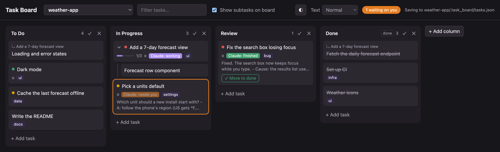
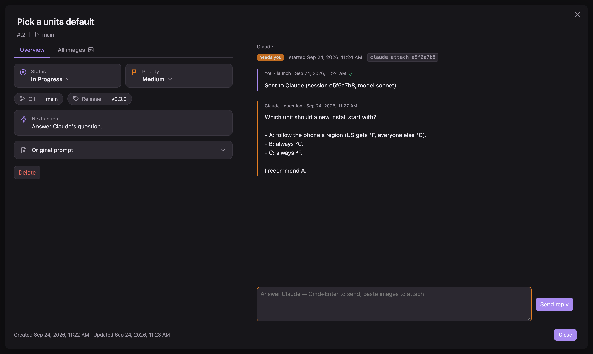
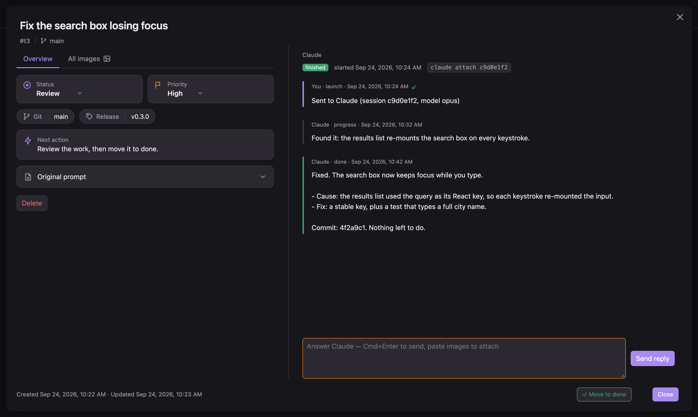

# onemoretask

A local kanban board that hands cards to Claude Code. Write a task, click **Send to Claude**,
and the agent works on it in the background, posting its progress, questions and results
back onto the card.



| Claude asks you a question | Claude reports it is done |
|---|---|
|  |  |

## Requirements

- macOS, Linux or Windows
- Python 3.7 or newer, and `git`
- [Claude Code](https://claude.com/claude-code) (the `claude` command), for Send to Claude

Desktop notifications are macOS only. The **Open folder…** dialog works on macOS and Windows;
on Linux, paste the folder's path. Everything else works the same on all three.

## Install

Run this in a terminal:

```bash
curl -fsSL https://raw.githubusercontent.com/astanar01/onemoretask/main/install.sh | sh
```

It:

- downloads the app to `~/.onemoretask`
- adds the `onemoretask` command to `~/.local/bin`
- adds `~/.local/bin` to your PATH if it isn't there yet (then open a new terminal)
- copies the task-observer skill that ships with the app into `~/.claude/skills/task-observer`
  (see [Skill observations](#skill-observations)). Your own copy is never changed.
  Set `ONEMORETASK_NO_OBSERVER=1` to skip this.

Already cloned the repo? Run `./install.sh` inside it instead. It uses that copy.

### Windows

No WSL needed. First install:

- Python from [python.org](https://www.python.org/downloads/), or `winget install Python.Python.3.12`
- [Git for Windows](https://git-scm.com/download/win), or `winget install Git.Git`.
  Claude Code on Windows needs its Git Bash anyway.
- Claude Code with its native Windows installer (`claude.exe`), so `claude` works from PowerShell

Then run this in PowerShell:

```powershell
irm https://raw.githubusercontent.com/astanar01/onemoretask/main/install.ps1 | iex
```

It downloads the app to `%USERPROFILE%\.onemoretask`, puts `onemoretask.cmd` in
`%USERPROFILE%\.local\bin`, adds that folder to your user PATH, and installs the task-observer skill
the same way. Open a new terminal after.

Already cloned the repo? Run `powershell -ExecutionPolicy Bypass -File install.ps1` inside it.

## Run

```bash
onemoretask
```

This starts the board and opens http://127.0.0.1:8765 in your browser. If the board is
already running, it just opens the page. Press **Ctrl-C** in the terminal to stop it.
It works the same in PowerShell, cmd or a macOS/Linux terminal. Without the command,
run `python3 launch.py` (Windows: `py launch.py`) in the app folder.

### Options

| Option | What it does |
|---|---|
| `--port 9000` | Use another port (default 8765) |
| `--project PATH` | Open this folder's board |
| `--permission-mode MODE` | Permission mode for agents started with Send to Claude (default `auto`) |

Without `--project`, the board opens the projects you used before. The first time, it opens
the git repo you run it from.

## Use

1. **Pick a project.** The project menu at the top switches boards. **Open folder…** adds any
   folder. Each project keeps its board in `<project>/.task_board/`. Commit `tasks.json` and
   `images/`; `agent_reports/` is run chatter and stays out of git.
2. **Add a task.** Give it a title, notes, subtasks. You can paste images into the notes.
3. **Send to Claude.** Pick a model (or leave the default) and send. A background Claude
   session starts in the project folder with the task as its prompt. Tick
   **Divide in subtasks / use subagents** to let it split the work.
4. **Follow the card.** It shows whether the agent is working, needs you, or is finished,
   and on macOS you get a notification when it needs you or finishes.
5. **Reply on the card.** Answer questions or ask for changes. The reply resumes the same
   session. You can also write while Claude is still working, to add information or change
   course. That message is a **note**. Claude reads it right after its current step, or just
   before it would stop. The card shows "Claude has it" once it is delivered. A hook that
   the board installs on each session it starts (`inbox.py`) does this. For a session started
   before this feature, the note goes in as soon as the session stops.
6. **Review the code.** A finished card in the Review column has a **Review code** button.
   It starts a fresh Claude session that finds the task's commits, runs the `commit-review`
   skill on them (one cheap pass; it ships in `skills/commit-review/`, and the reviewer reads it
   from there if it is not installed in `~/.claude/skills/`), and
   posts the findings on the card. Pick the budget in the task panel: Low, Medium (default)
   or High. Reply to have it fix the findings.

### Skill observations

The install command also adds the task-observer skill. The app ships its own copy in `skills/task-observer/`,
a fork of Eoghan Henn's [one-skill-to-rule-them-all](https://github.com/rebelytics/one-skill-to-rule-them-all)
(CC BY 4.0), so nothing is downloaded from that repo. Each install replaces the copy it put there before
(the one with a `FORKED_FROM` file). Delete that file to keep your own edits.

The skill notes what could make your Claude skills better while Claude works: a correction you made,
a step that kept failing, a workflow worth keeping. Every session the board starts is told to run it.

- The **Observations** button in the header shows how many are open. It reads
  `<project>/skill-observations/` and `~/.claude/skill-observations/` (both the older `log.md` and
  the newer `observation-log/` folder).
- Click it to see the list. Click an observation to read it.
- Tick the ones you want and click **Apply**. The board makes a new card, "Apply N skill
  observations", and sends it to Claude. Claude edits the skills, marks each observation done, and
  reports on the card like any task. It asks you first if one needs a decision, such as a new skill.

The ◐ button in the header switches the theme: System (follows your computer), Light, or Dark.

To see a session in the terminal: `claude agents` lists them and `claude attach <id>` opens one.

### Posting from an agent

Agents post to their card with `report.py`. The prompt Send to Claude builds already
tells them how:

```bash
python3 report.py --board <project>/.task_board <task_id> progress "what I'm doing now"
python3 report.py --board <project>/.task_board <task_id> question "what I need you to decide"
python3 report.py --board <project>/.task_board <task_id> done "what I did, what is left"
```

Add `--image <file>` to attach a screenshot.

## Where your tasks are saved

Everything is plain files on your computer. There is no database and no account.

Each project keeps its board in a `.task_board/` folder at the project's root:

```
<project>/.task_board/
├── tasks.json            the board: columns and tasks
├── images/               images pasted into a task's notes
├── .gitignore            keeps agent_reports/ out of git
└── agent_reports/
    ├── <task_id>.json    the messages on that card (you and Claude)
    ├── <task_id>.prompt.txt  the exact prompt Claude got when the task was sent
    └── images/           images from replies and report.py --image
```

- **Commit** `tasks.json` and `images/` if you want the board in git. `agent_reports/` is
  left out by the `.gitignore` the board creates.
- **Images** are named by a hash of their content, e.g. `3f9a1c0b7d2e4a61.png`.
  PNG, JPEG, GIF and WebP, up to 25 MB each.
- A project that already has `tools/task_board/tasks.json` keeps using that folder.

### `tasks.json`

```json
{
  "version": 1,
  "columns": [
    { "id": "mufe2liudtw8l", "name": "To Do", "done": false },
    { "id": "mufe2liuhd9ph", "name": "Done", "done": true }
  ],
  "tasks": [
    {
      "id": "mufeqdivus3yp",
      "title": "Add a 7-day forecast view",
      "notes": "Show highs, lows and rain chance.",
      "priority": "high",
      "tags": ["ui"],
      "column": "mufe2liudtw8l",
      "parent": null,
      "order": 0,
      "created": "2026-09-24T10:46:58.039Z",
      "updated": "2026-09-24T10:56:30.709Z",
      "agent": { "id": "04cc185b", "started": "2026-09-24T10:48:28.936Z", "model": "opus" }
    }
  ]
}
```

- `priority` is `""`, `"low"`, `"med"` or `"high"`.
- `parent` is the id of the parent task, or `null` for a top-level task. Subtasks are just
  tasks with a parent.
- `done: true` marks the column whose tasks count as finished.
- `agent` is only there once the task was sent to Claude. It holds the Claude session id.
- Optional fields: `images` (file names in `images/`), `delegate` and `subagentModel`
  (the **Divide in subtasks** options).

### Card messages: `agent_reports/<task_id>.json`

A list of messages, oldest first:

```json
[
  { "at": "2026-09-24T10:48:28+00:00", "status": "launch", "message": "Sent to Claude (session 04cc185b, model opus)", "from": "you", "session": "04cc185b" },
  { "at": "2026-09-24T10:49:24+00:00", "status": "done", "message": "Added the forecast view.", "from": "claude" }
]
```

`status` is `launch`, `reply`, `review`, `progress`, `question`, `done` or `answer`. `images` (file
names) and `session` are added when they apply.

### Outside the project

| File | What it holds |
|---|---|
| `~/.config/task_board/projects.json` | The projects you opened, for the project menu |
| `~/.config/task_board/default_model.json` | The name of your default Claude model, cached for 24 hours |
| `~/.claude/skills/task-observer/` | The task-observer skill, copied there by the install command |
| `<project>/skill-observations/`, `~/.claude/skill-observations/` | Observations the skill logs. The board only reads them |
| `~/.claude.json` | Only when you click **Trust folder and send**: marks that folder as trusted, like accepting Claude Code's own trust prompt |
| Your browser's local storage | View settings only: theme, text size, show subtasks, collapsed groups, last project, last model picked, which cards you have read |

If you open `index.html` straight from disk (a `file://` page) instead of running the
server, the board is saved in the browser's local storage only.

## Privacy: everything stays on your computer

onemoretask has no cloud service, no account, no analytics and no tracking.

- The server listens only on `127.0.0.1`, so other computers can't reach it.
- It only accepts changes from the board page itself. Other websites open in your
  browser can't use it to start agents or write files.
- The page loads nothing from the internet: no fonts, scripts or images from other sites.
- Your tasks, messages and images are only saved in the files listed above.

What does leave your computer, and why:

- **Send to Claude and replies.** They run Claude Code (`claude`), which sends the task's
  title, notes, subtasks and your replies to Anthropic, plus any image Claude opens, the same
  as when you use Claude Code in a terminal. No task data goes out until you click Send.
- **The default model name.** To show the name of your default model, the board runs
  `claude -p "Reply: ok"` at most once a day (about $0.09). It sends no task data. It is
  skipped if your Claude settings or `ANTHROPIC_MODEL` already name a model.
- **Install and update.** The install command downloads the app from GitHub.

## Update

Run the install command again. It pulls the latest version into `~/.onemoretask`.
Installed from your own clone? Run `git pull` in it instead.
Then restart the board (Ctrl-C in its terminal, then `onemoretask`): a running board keeps its old
server code until restarted.

## Uninstall

```bash
rm ~/.local/bin/onemoretask
rm -rf ~/.onemoretask
rm -rf ~/.config/task_board   # remembered projects and settings
rm -rf ~/.claude/skills/task-observer   # only if you don't want the skill any more
```

On Windows (PowerShell):

```powershell
Remove-Item ~\.local\bin\onemoretask.cmd
Remove-Item -Recurse -Force ~\.onemoretask
Remove-Item -Recurse -Force ~\.config\task_board
```

Your boards stay in each project's `.task_board/` folder.

## More

Full behaviour: the header docstring of `server.py`. Board storage: `reports.py`.
